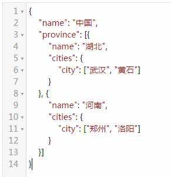
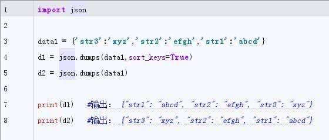
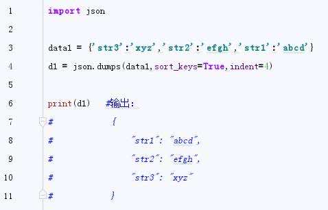

# Python 如何操作 Json？

> Json（JavaScript Object Notation）它是一种轻量级的数据交换格式，具有数据格式简单，读写方便易懂等很多优点。许多主流的编程语言都在用它来进行前后端的数据传输，大大的简化了服务器和客户端的开发工作量。相对于XML来说，更加的轻量级，更方便解析，因此许多开发者都遵循Json格式来进行数据的传输和交换。今天我们详细介绍一下Python在Json的编解码方面的知识。[阅读原文](https://baijiahao.baidu.com/s?id=1608659655547720220&wfr=spider&for=pc)

<!--more-->

# json的数据格式
在json中，遵循“键值对”的这样一种方式，比如：“{"name":"tom"}”,就是一个json格式的数据，json的格式归纳下来，一般有以下几点：

- 对象通过键值对表现；
- 键通过双引号包裹，后面跟冒号“:”，然后跟该键的值；
- 值可以是字符串、数字、数组等数据类型；
- 对象与对象之间用逗号隔开；
- “{}”用来表达对象；
- “[]”用来表达数组；

我们看一个略为复杂一点的例子：

上例则是一个典型的json格式的数据，强大的Python提供了一个“json”模块，可以方便的将各种零散的数据通过模块的内置函数编码形成一个json格式的数据，也可以将一个json格式的数据解码形成自己需要的数据，非常好用，下面我们就来介绍一下。

# json.dumps()
json模块里的dumps函数是对数据进行编码，形成json格式的数据，我们看一下下面的例子：

通过输出的结果很容易看出，通过dumps方法使字典转换成为了json格式，虽然它们非常相似。其中，在dumps里的参数“sort_keys=True”，使得输出json后对key和value进行0~9、a~  z的顺序排序，如果不填，则按照无序排列。有时候，通过排序可以方便地比较json中的数据，因此，适当的排序是很有必要的。

此外，“Indent”参数表示缩进的意思，它可以使得输出的Json看起来更加整齐好看，可读性更强，例如：

下面列举一下dumps（）的可填参数：

- skipkey：默认为False，当dict对象里的数据不是Python的基本数据类型；（str,unicode,int,long,float,bool,None）时，当skipkey为False，就会报错，如果skipkey为True，则可以跳过这类key；
- indent：如果填0或者不填，则按照一行进行打印，否则按照indent的数值显示前面的空格（正整数形式）；
- separators：分隔符，默认为“(',',':')”，它表示key之间用“,”隔开，key和value之间用“:”隔开；
- encoding：编码格式，默认值是UTF-8；
- sort_keys：对key、value进行排序，默认值是False，即不排序；
- ensure_ascii：默认为True，如果dict对象里含有none-ASCII的字符，则显示\uXX的格式，如果为False，则能正常显示出来；

# json.loads()
和dumps相反，loads函数则是将json格式的数据解码，转换为Python字典，我们看一下下面的例子：

有时候，输出结果遇到中文的时候，会出现编码格式不一样的情况，显示出为Unicode的编码格式，使得不易读懂，解决办法是添加参数“encoding”参数，即上面的改写成这样：d1 = json.loads(data1,encoding='utf-8')即可。

# json.dump() 和 json.load()
相对于上面所讲的dumps和loads来说，dump和load函数的功能类似，只不过前者是用来处理字符串类型的，而后者是用于处理文件类型的，如下所示：

上例列举出了json的四个方法：dumps（）和dump（）、loads（）和load（）的简单使用方法，可见，Python对于json的处理相当方便，不像c++那样（谁用谁知道）。
