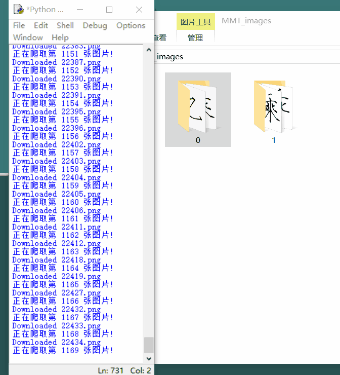
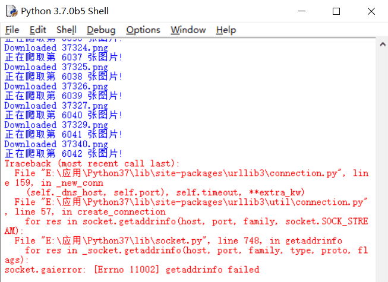
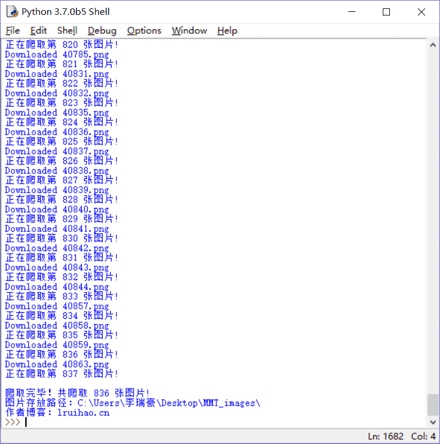

# python 爬取网站图片（图片链接相似）


> 以下程序对 [该网址](https://hw.xiezixiansheng.com/mobile.php?c=Grzkreader&a=fontshowPics&u=qbfRl8gPF2s-&z=Kqz%2FRroVGYc-&share=1&from=singlemessage) 内的手写体图片进行爬取！这个手写体是我在手机上通过《手迹造字》app 书写的，大概 6886 个字符，历时两年多，目前仍在修改中。[字体效果查看](https://lruihao.cn/posts/font-mmt/)

<!--more-->

# 思路设计
> 通过观察目标网页中字符图片的链接，很容易发现每个字符图片的直链是由两部分组成。
- 固定链接
- 图片文件编号

> 其中固定连接为`https://image.xiezixiansheng.com/users/2010/700/unzip/579767/`, 图片文件为`xxxxx.png@50q`，如果去掉@50q，获取到的图片就是透明背景的不然就是白色背景。然后发现编号大多是 5 位数的形式，但是还有一些是 4 位的，甚至还有 2-3 位的数字。仔细看看 127 前的编号都是一些国际符号诸如英文和数字等。比对一下发现正是 ASCII 码对应的命名方式。可想而知中文自然也是通过编码来命名的。一个标准的字库文件至少包含 6763 个汉字，也就是我书写的这个`GB2312-80`, 范围： `0xA1A1 - 0xFEFE`，其中汉字范围： `0xB0A1 - 0xF7FE`。两个 16 进制位对应一个字节，一个汉字至少由两个字节组成，这样理解，范围自然是 4 个 16 进制位。所以转换成 10 进制，范围大致在 65278 以下。要了解更加具体一点的范围还需要去查一下汉字编码的分区等。这里暂时不必了解，因为本来就打算暴力下载。

> **说了这么多，既然图片链接这么简单，所以我是想暴力遍历，搜索图片，判断链接状态码，然后下载图片。**

# 源码设计
大致分为三个范围吧
- 英文字符
- 中文符号
- 汉字范围

> 我主要分这几个区间查找

- 33 ~ 126
- 8212 ~ 8243
- 12289 ~ 12305
- 19968 ~ 40864
- 65281 ~ 65509

磨刀不误砍柴工，分析观察了这么久，终于可以运行程序了，F5 后就静静等待吧，可以去看看 java，或者打一把王者 hhhhh!
```python
import os
import requests

path="C:\\Users\\李瑞豪、\Desktop\\MMT_images\\" #下载路径： 绝对或者相对路径比如。/image/
os.makedirs(path+"0\\", exist_ok=True) # 创建文件夹
os.makedirs(path+"1\\", exist_ok=True)

# 下载图片
def urllib_download(url,num):  # （下载链接，图片编号）
    from urllib.request import urlretrieve
    urlretrieve(url,path+num+".png")     

# 判断状态码
def get_status(url):  
    r = requests.get(url, allow_redirects = False)  
    return r.status_code

def main():
	BASE_URL = "https://image.xiezixiansheng.com/users/2010/700/unzip/579767/"
	n=33
	total=0
	print("正在爬取第 1 张图片！")

	while n < 65510:
		#分段爬取，不然会超时！！！# 33 ~ 126 # 8212 ~ 8243 # 12289 ~ 12305 # 19968 ~ 40864 # 65281 ~ 65509
		if n == 127:
			n = 8212
			continue
		elif n == 8244:
			n = 12289
			continue
		elif n ==12306:
			n = 19968
			continue
		elif n == 40865:
			n = 65281
			continue

	# for n in range(37341,40865):
		num = str(n)
		IMAGE_URL = BASE_URL+num+".png" # xxx.png 是透明背景，xxx.png@50q 是白色背景，分别存放在 0，1 文件夹 p 是中小 w 是小图
		if(get_status(IMAGE_URL)==200): # 同时下载透明和白色背景的图片
			total+=1
			urllib_download(IMAGE_URL,"0\\"+num)
			IMAGE_URL += "@50q"
			urllib_download(IMAGE_URL,"1\\"+num)
			print("Downloaded "+num+".png")
			print("正在爬取第",total+1,"张图片！")
		n+=1

	print("\n 爬取完毕！共爬取",total,"张图片！")		
	print("图片存放路径："+path)
	print("作者博客：lruihao.cn")

if __name__=="__main__":  
    main(); 
```

# 爬取过程及结果
> 文件夹左下角数目变化




说实话看着控制台不停地输出提示信息有没有很爽，对于强迫症来说真的是很治愈了！但是爬取第 6042 张图片的时候，我打开了一下目标网页发现无法加载图片了，就想这应该也算是一次 Dos 攻击了吧！打开控制台果然停了，相当于访问了近两万次！唉，还是太暴力了！！还差 800 多张，只好又重新接着写上次的位置爬！不慎造成目标网站服务器压力，实在对不起！




> 一个半小时左右后终于下载完了，一共是 6886 张；程序是同时下载了透明和白色背景的图片的！分别在 0,1 子文件夹！



# 其他思路
模拟浏览器载入 html 文件，获取源码，查找到所有``标签内链接，必要时配合正则表达式，然后下载图片。

