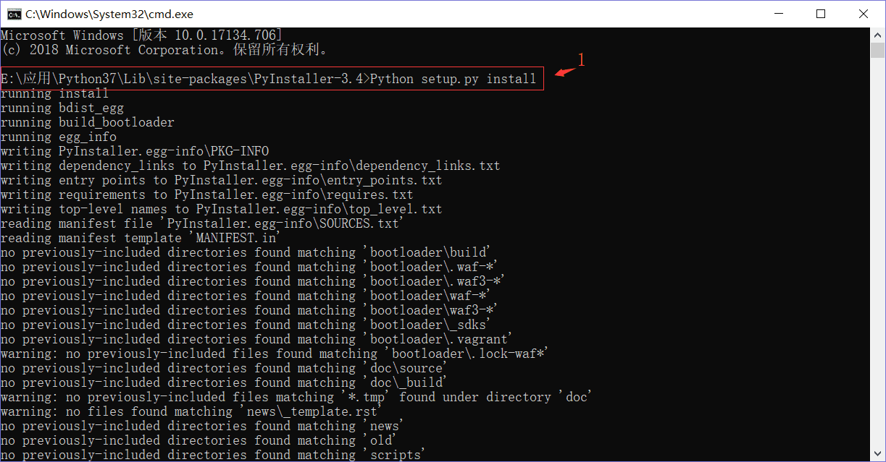
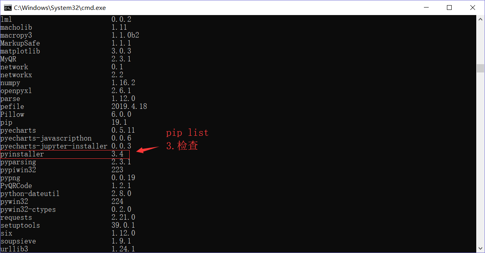
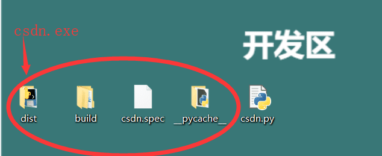

# 安装pyinstaller出错的解决办法及csdn工具实例打包


> 用过命令`pip install pyinstaller`安装失败，此包依赖于pywin32，安装前需要先`pip install pywin32`,我安装了还是出错，稍微百度了一下也没有看到解决办法。
这里通过手动下载安装解决的，记录一下。

<!--more-->

# 下载
去官网下载pyinstaller安装包：<https://pypi.org/project/PyInstaller/#files>

# 解压
我这里解压到`E:\应用\Python37\Lib\site-packages\PyInstaller-3.4`

# 安装
cmd也进入到上面的路径下，然后执行`Python setup.py install`，等待安装完毕






# pyinstaller简介
pyinstaller将Python脚本打包成可执行程序，使在没有Python环境的机器上运行。

最新版是pyinstaller 3.4，可运行在Windows，Mac和Linux操作系统下。 但它不是跨编译的，也就是说在Windows下用PyInstaller生成的exe只能运行在Windows下，在Linux下生成的只能运行在Linux下。

# 打包
打包的app里并不包含任何源码，但将脚本的.pyc文件打包了。

基本语法： `pyinstaller options myscript.py`
> 常用的可选参数如下： 
`--onefile` 将结果打包成一个可执行文件
`--onedir` 将所有结果打包到一个文件夹中，该文件夹包括一个可执行文件和可执行文件执行时需要的依赖文件（默认）
`--paths=DIR` 设置导入路径
`--distpath=DIR` 设置将打包的结果文件放置的路径
`--specpath=DIR` 设置将spec文件放置的路径
`--windowed` 使用windows子系统执行，不会打开命令行（只对windows有效）
`--nowindowed` 使用控制台子系统执行（默认）（只对windows有效）
`--icon=<FILE.ICO>` 将file.ico添加为可执行文件的资源(只对windows有效）

如`pyinstaller --paths="D:\" test.py`

# CSDN访问量脚本实例
比如，拿以前写的一个刷csdn访问量工具csdn.py（放在桌面上），[代码详见](/posts/csdnvisiter.html)

在cmd进入桌面路径，输入如下命令
```shell
pyinstaller --onefile --nowindowed csdn.py
```



另外推广一下自己的微信公众号，欢迎关注公众号👇👇👇，后台回复关键词`csdn_visiter`获取源码及exe可执行文件。
