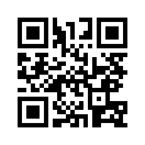

# 用 MyQR 制作专属动态二维码 (py 和 exe 版本）


> **Python 二维码生成器**是 github 上@sylnsfar 开源的一个 python 生成二维码工具。有 python, 网页及 exe 版本，详见 [sylnsfar/qrcode](https://github.com/sylnsfar/qrcode/)，本文主要介绍记录一下 python 版本使用。exe 可以去 [项目开源地址](https://github.com/sylnsfar/qrcode_win) 下载，公众号文章后台回复关键词“qrcode”获取链接。

可生成*普通二维码*、*带图片的艺术二维码（黑白与彩色）*、*动态二维码（黑白与彩色）*。

<!--more-->
## 示例



```python
from MyQR import myqr
import os
version, level, qr_name = myqr.run(
    words='https://lruihao.cn',
    version=1,
    level='H',
    picture='2.jpg',
    colorized=True,
    contrast=1.0,
    brightness=1.0,
    save_name=None,
    save_dir=os.getcwd()
)

# help(myqr)
# https://github.com/sylnsfar/qrcode/
'''
Positional parameter
   words: str # 链接或者文字

Optional parameters
   version: int, from 1 to 40  # 控制边长
   level: str, just one of ('L','M','Q','H') # 控制纠错水平，从左到右依次升高。
   picutre: str, a filename of a image # 图片，需在同路径，默认 None
   colorized: bool  # 是否彩色 默认 False
   constrast: float # 对比度 默认 1.0
   brightness: float # 亮度 默认 1.0
   save_name: str, the output filename like 'example.png' #控制文件名，默认 None,'qrcode.png'
   save_dir: str, the output directory # 储存路径
'''
```

## 安装

```python
# 通过 pip
pip(3) install myqr(or MyQR)
```

## 使用方法

### 命令行方式

*（**提示**：如果你尚未安装 [**MyQR**](https://pypi.python.org/pypi/MyQR) ，以下内容请使用`python(3) myqr.py` 而非`myqr` 。）*

```python
# 概括
myqr 	Words
		[-v {1,2,3,...,40}]
		[-l {L,M,Q,H}]
        [-n output-filename]
		[-d output-directory]
		[-p picture_file]
		[-c]
		[-con contrast]
		[-bri brightness]
```

- 普通二维码 介绍了 `Words`, `-v`, `-l`, `-n`, `-d` 
- 艺术二维码 介绍了  `-p`, `-c`, `-con`, `-bri`
- 动态 GIF 二维码 介绍了动态的生成方法和注意点

#### 普通二维码

```markdown
#1 Words
myqr https://github.com
```

* 在命令后输入链接或者句子作为参数，然后在程序的当前目录中产生相应的二维码图片文件，默认命名为 “qrcode.png”。

```markdown
#2 -v, -l
myqr https://github.com -v 10 -l Q
```

* **默认边长**是取决于你输入的信息的长度和使用的纠错等级；

  而**默认纠错等级**是最高级的 H。

* **自定义**：如果想要控制边长和纠错水平就使用 `-v` 和 `-l` 参数。

   `-v` 控制边长，范围是** 1 至 40**，数字越大边长越大；

   `-l` 控制纠错水平，范围是** L、M、Q、H**，从左到右依次升高。

```markdown
#3 -n, -d
myqr https://github.com -n github_qr.jpg  -d .../paths/
```

- **默认输出文件名**是“ qrcode.png "，而**默认存储位置**是当前目录。

- 自定义：可以自己定义输出名称和位置。**注意**同名文件会覆盖旧的。

  `-n` 控制文件名，格式可以是 `.jpg`， `.png` ，`.bmp` ，`.gif` ；

  `-d` 控制位置。

  

#### 艺术二维码

```markdown
#1 -p
myqr https://github.com -p github.jpg
```

* 参数`-p` 用来将 QR 二维码图像与一张同目录下的图片相结合，产生一张**黑白**图片。

  
```markdown
#2 -c
myqr https://github.com -p github.jpg -c
```

* 加上参数 `-c` 可以使产生的图片由黑白变为**彩色**的。

```markdown
#3 -con, -bri
myqr https://github.com -p github.jpg [-c] -con 1.5 -bri 1.6
```

* 参数`-con` 用以调节图片的**对比度**，1.0 表示原始图片，更小的值表示更低对比度，更大反之。**默认为 1.0**。

* 参数 `-bri` 用来调节图片的**亮度**，其余用法和取值与 `-con` 相同。

#### 动态 GIF 二维码

动态二维码与上述的带图片的二维码的生成方法没什么区别，你只要采用 `.gif` 格式的图片即可生成黑白或者彩色的动态二维码。但**注意**如果使用了 `-n` 参数自定义输出的文件名，切记其格式也必须是 `.gif` 格式。

### 作为导入文件

```python
# 安装模块后
from MyQR import myqr
version, level, qr_name = myqr.run(
	words,
    version=1,
    level='H',
    picture=None,
    colorized=False,
    contrast=1.0,
    brightness=1.0,
    save_name=None,
    save_dir=os.getcwd()
	)
```

*以下各个参数已经在**上文命令行方式**有所介绍*

```python
# help(myqr)
Positional parameter
   words: str

Optional parameters
   version: int, from 1 to 40
   level: str, just one of ('L','M','Q','H')
   picutre: str, a filename of a image
   colorized: bool
   constrast: float
   brightness: float
   save_name: str, the output filename like 'example.png'
   save_dir: str, the output directory
```

## 使用提示

* 请采用**正方形**或近似正方形的图片

* 建议在图片尺寸大的时候使用 `-v` 的值也应该**适当**变大。

## 可用字符

* 数字 0 到 9

* 大小写的英文字母

* 常用**英文标点符号**和空格

  ```console
  · , . : ; + - * / \ ~ ! @ # $ % ^ & ` ' = < > [ ] ( ) ? _ { } | and  (space)
  ```

## 依赖库

* [pillow](https://pypi.python.org/pypi/Pillow/3.3.1)
* [numpy](https://pypi.python.org/pypi/numpy)
* [imageio](https://pypi.python.org/pypi/imageio)

## 运行环境

* Linux, Python 3
* Windows, Python 3
* Mac, Python 3

