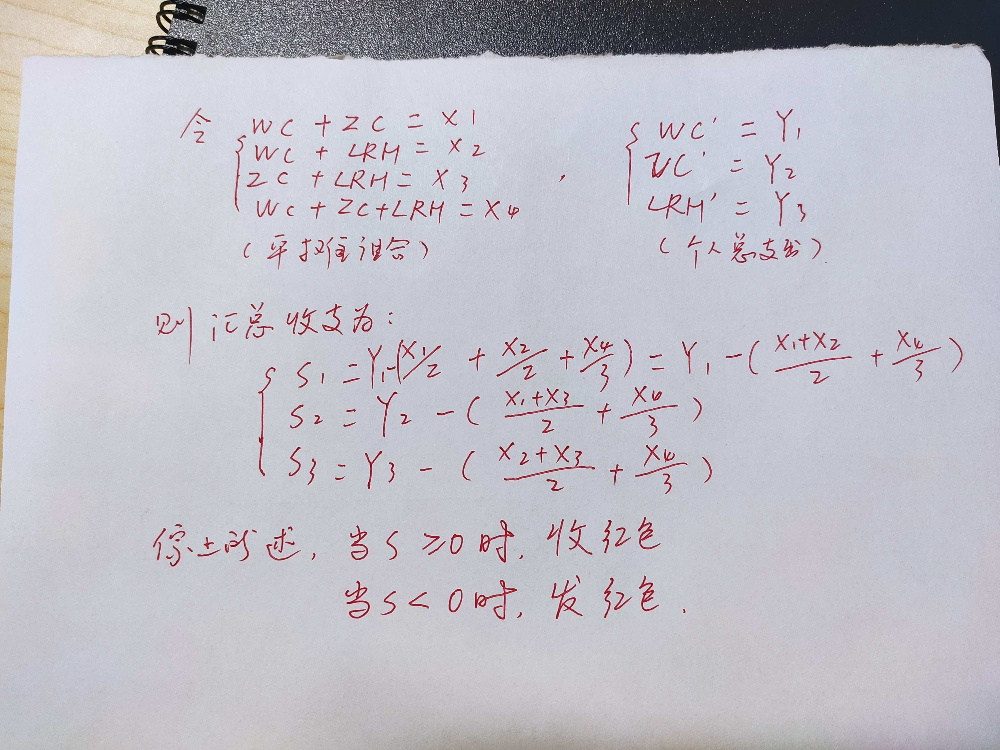

# 基于 leancloud-storage 实现的无后端记账本

# 起因

事情是這樣，年前和朋友一起合租了一個房子，然後捏，生活嘛，除了開心，當然是乾飯最大啦！

自然就會有購物，買菜等日常消費，那就要記賬，一開始是各自記在手機的便簽上，最後再算一下；  
三個人，一共七种組合消費，排除各自消費的三種情況，也有四種 (`AB, AC, BC, ABC`)。好麻煩啊！！！


<!--more-->

# 經過
作為一個程序猿，怎麼能接受這麼麻煩的記賬方式呢，拿起筆就開始畫，於是有了下面這張圖的公式。簡單說明一下就是：  
設前面說的四種組合為：`X1, X2, X3, X4`，個人實際付款總額為：`Y1, Y2, Y3`，那麼帶入未知數，我們就可以算出每個人最後結算時的錢：`S1, S2, S3`，  
綜上所述，很好理解，當 `S >= 0` 時，收紅包，當 `S < 0` 時，發紅包。  



OK，一個簡單的初中方程式已經到位了，下一步，思考一下，用什麼來運作這個這個方程。來，先跑個題，春節期間，不是每天都要在騰訊文檔上填表記錄活動軌跡嗎？ 再回來，那不如就用 excel 實現吧，三個人都可以在手機上編輯。好的，說做就做。  

一頓操作，10 minutes later...  
只新建了一個 excel 文件，O.o! 不會 excel，果斷放棄，另尋他路。  

# 結果
回到本職，那不如寫個網站吧，可是畢業後，學生機服務器也過期了，怎麼搞？那就寫個純前端的，數據呢存哪裡？  
別急，重新擼一擼需求先：  
- 存取消費數據
- 計算每月，實付（總分），應付以及最後計算結算金額
- 按月查詢，月結賬單
- 三人皆可編輯

主要就是存取數據這點，沒有服務器，數據庫怎麼實現？  
valine 可以實現無後端，那我是不是也可以，leancloud 文檔走一波，然後“數據表”設計一下，其實是 leancloud-storage Object ，於是有了以下東西，源碼放在 Github



## 數據設計
去 leancloud 创建一个应用，再新增一个 Bill Class, 补充一下字段：

| name | type   | description |
| ---  | ---    | ---     |
| pay  | Number | 消费金额 |
| pay_description | String | 消费描述 |
| pay_type | String | 消费类型 |
| pay_user | String | 付款人 |

## 主要邏輯

### 初始化
set for yourself.
```js
AV.init({
  appId: '',
  appKey: '',
  serverURL: ''
});
```

### 存數據
```js
//記賬提交按鈕事件監聽
document.querySelector('.submit').addEventListener('click',function(event){
  event.preventDefault();
  let formPay = document.querySelector('#form-pay');
  let bill = new AV.Object('Bill');
  bill.set('pay', Number(formPay.pay.value));
  bill.set('pay_type', Number(formPay.pay_type.value));
  bill.set('pay_user', Number(formPay.pay_user.value));
  bill.set('pay_description', formPay.pay_description.value);
  bill.save().then((object) => {
    formPay.reset();
  }, (function (error) {
    console.log(JSON.stringify(error));
    alert('保存失敗');
  }))
});
```

### 取數據
```js
/**
 * 獲取歷史消費記錄數據
 * @param [start=0] 開始位置
 * @param [count=15] 每次查詢筆數
 */
function getBillData(start = 0,count = 15) {
  queryBill.descending('createdAt')
    .skip(start * count).limit(count)
    .find().then(function (response) {
      let billLength = response.length;
      if(billLength > 0){
        billVm.noMore = (billLength !== count) ? true : false;
        for(bill of response){
          billVm.bills.push({
            pay: bill.attributes.pay,
            payType: payType[bill.attributes.pay_type],
            payUser: payUser[bill.attributes.pay_user],
            payDescription: bill.attributes.pay_description,
            payDt: new Date(bill.createdAt).toLocaleString()
          })
        }
      } else {
        billVm.noMore = true;
      }
  });
}

/**
 * 獲取月賬單數據
 * @param month 年月份 fmt: yyyy-MM
 */
function getMonthBill(month){
  let dateTime = `${month} 00:00:00`
  let startMonth = new Date(dateTime);
  let nextMonth = new Date(new Date(dateTime).setMonth(startMonth.getMonth() + 1));
  let startDateQuery = new AV.Query('Bill');
  startDateQuery.greaterThanOrEqualTo('createdAt', startMonth);
  let endDateQuery = new AV.Query('Bill');
  endDateQuery.lessThan('createdAt', nextMonth);
  let MonthBillQuery = AV.Query.and(startDateQuery, endDateQuery);
  MonthBillQuery.find().then(function(response){
    billVm.monthBill = {
      payType0: 0,
      payType1: 0,
      payType2: 0,
      payType3: 0,
      payUser0: 0,
      payUser1: 0,
      payUser2: 0
    };
    for(bill of response){
      let {pay, pay_type, pay_user} = bill.attributes;
      billVm.monthBill[`payType${pay_type}`] += pay;
      billVm.monthBill[`payUser${pay_user}`] += pay;
    }
  });
}
```

## 技術棧
- leancloud-storage
- Vue.js
- HTML,CSS,JS

# 總結
簡單總結一下，登录功能不做，安不安全自己说了算。删除修改功能也不做，直接上 leancloud 操作，css 美化的样式也不写，干净又卫生！  
然后衍生一下，什么过年斗地主，天炸，麻将，字牌记账系统那不也是同理可得嘛！

over!


